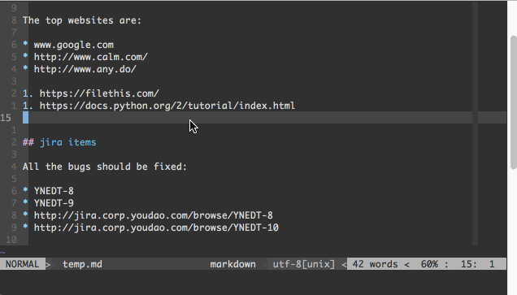

# mkdInput.vim

Get url title and input as markdown format.

This plugin needs `curl` support.

## Usage

1. `:UpdateLink`
1. `:UpdateJira`



## `~/jira.vim`

```vimscript

let g:jira_username='jira-user-name'
let g:jira_password='jira-password'

" the url prefix for jira issue item
let g:jira_url_prefix='http://jira.abc.com/path/'


" function to filter page title
function! JiraTitleFilter(title, url)
    let jiraItemPattern = '\/[a-zA-Z]\+-[0-9]\+'
    let filteredTitle = a:title

    " is a jira item
    if match(a:url, jiraItemPattern) > -1
        let start = '^\s*\[[A-Z0-9a-z-]\+\]\s*'
        let end = '\s\+-\s\+ABC\s\+JIRA\s*$'
        let filteredTitle = substitute(filteredTitle, start, '', '')
        let filteredTitle = substitute(filteredTitle, end, '', '')
    endif

    return filteredTitle
endfunction

```

## chang log

-   2019-05-24
    -   Use `curl` to download file, `python` is not need
-   2019-05-05
    -   Change dependence from `python` to `python3`
-   2016-01-13
    -   Add support for multiple urls in one line
    -   Better performance
